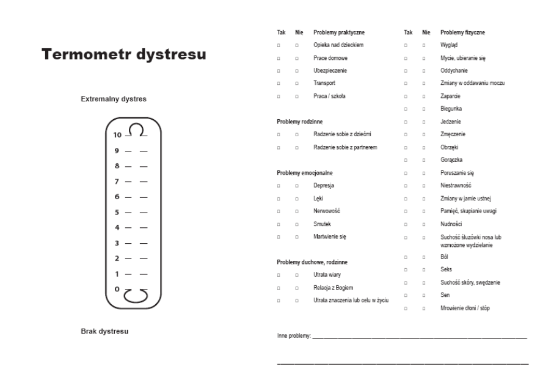
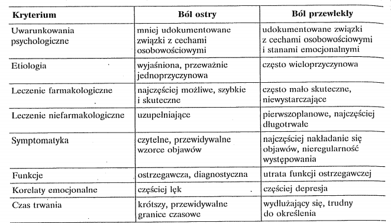
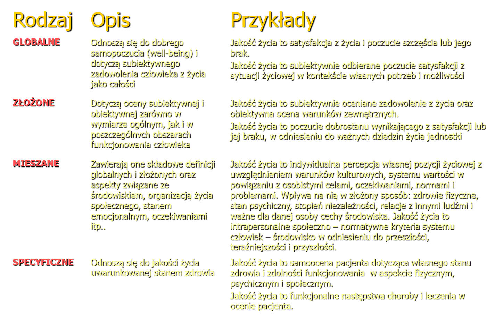

# Część od Majko

### Podejście nomotetyczne i idiograficzne do badań

* **nomotetyczne** - n. przyrodnicze, Psych. behawioralna Czas przeżycia (średni), Średnia JŻ, Sens życia – badanie grup
* **idiograficzne** - n. humanistyczne, Psych. humanistyczna, Jakość życia (koncepcja indywidualistyczna), indywidualna reakcja na chorobę. Sens życia – analiza przypadku.

### Drabina Cantrila

"Poniżej znajdują się dwie “drabiny”, dół drabiny (0) oznacza najgorsze życie jakiego mógłby się Pan(i) spodziewać, wierzchołek (10) najlepsze życie jakiego mógłby się Pan(i) spodziewać. Proszę zakreślić na “drabinie” miejsce w jakim zgodnie z Pani(a) odczuciem znajduje się obecnie Pani(a) życie ( 1 “drabina”) i w jakim spodziewa się Pan(i) znaleźć za trzy lata."

### Pomiar jakości życia uwzględniający podejście indywidualistyczne - dr Ruta

| BYĆ | MIEĆ | PRZYNALEŻEĆ |
|---------------------|-----------------|-----------------------|
| kim jestem | związki z otoczeniem | cele, nadzieję, aspiracje |
| wymiar fizyczny (zdrowie, wygląd) | wymiar fizyczne (dom, miejsce pracy) | wymiar praktyczny (aktywność, praca)|
| wymiar psychologiczny (zdrowie psychiczne, samopoczucie | wymiar psycho-społeczny (znajomi, rodzina) | czas wolny (zainteresowania) |
| wymiar duchowy (wiara) | wymiar socjalny (dochody, możliwości) | rozwój osobisty (adaptacja do zmian) |

### Model relacji pomiędzy subiektywną oceną jakości życia a obiektywnymi warunkami

| OCENA OBIEKTYWNA | SUBIEKTYWNE ODCZUCIA |
| -----------------|--------------|--------------|
| - | pozytywne | negatywne |
| **korzystna** | zadowolenie uzasadnione | dylemat niezadowolenia |
| **niekorzystna** | paradoks zadowolenia | niezadowolenie uzasadnione |

### Termometr dystresu 

### Jakie są gazetki o quality of life?

* **"Quality of life reasearch"** -> 1,95 IFów
* **"Health and quality of life outcomes"** nieoficjalnie `nie wiem o chuj chodzi` 2 IF

# Część od tej laski nawiedzonej 

`z książki Heszen`

### Psychologia zdrowia

Centrum zainteresowań tej dziedziny jest zdrowie, co oznacza przekroczenie granic medycyny i objęcie wszystkich najważniejszych dziedzin życia i działalności człowieka. W psychologii zdrowia, traktowej zarówno jako dziedzina badań jak i obszar zastosowań praktycznych, wyróżnić można 2 działy:

* **"Kliniczna psychologia zdrowia"** - obejmuje psychologiczne aspekty chorób
* Drugi dział koncentruje się na psychologicznych korelatach zdrowia

### Modele i podejścia stosowane w psychologii zdrowia

1. **Model biomedyczny** - ciało i "dusza" są odrębne, zdrowie to brak choroby
2. ** Model holistyczno - funkcjonalny** - człowiek jest częścia większej całości i pozostaje w relacji człowiek środowisko. Zdrowie to proces stałego równoważenia potrzeb człowieka i wymagań środowiska. Zdrowie i choroba są na jednym kontinuum.
3. **Model socjoekologiczny** - Człowiek zajmuje miejsce centralne w jakiejś całości, gdzie jest środowisko i inne takie. Zdrowie to zasób, który podlega rozwojowi.

### Ból 

`BÓÓÓÓÓÓÓÓÓÓÓÓL`

1. **BÓL** - nieprzyjemne doznanie zmysłowe i emocjonalne związane z aktualnie występującym lub potencjalnym uszkodzeniem tkanek albo opisywane w kategoriach takiego uszkodzenia

### Jakość życia

