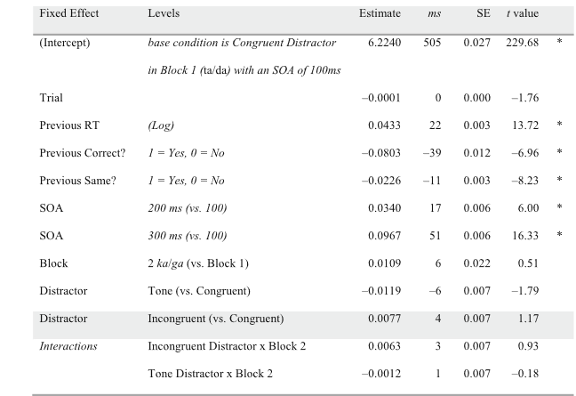

##### Badania, ukazuj¹ ¿e fonetyczne cechy mowy i szybko wypowiadania mog¹ byæ modulowane przez wiele bodŸców, które docieraj¹ do mówcy.
Schrefiers, Meyer, Levelt (1990) wskazuj¹, ¿e szybkoœæ reakcji (podanie nazwy przedmiotu z ilustracji) zwiêksza siê jeœli s³ysz¹ dystraktor, który rymujê siê z dan¹ nazw¹. Badania Galantucci et al. (2009) ukazuj¹, ¿e kszas reakcji odnosi siê do efektu percepcyjno-motorycznego, poniewa¿ jest wspó³zale¿ne z procesem przygotowania wypowiedzi. 

# Eksperyment 1 - Efekt dŸwiêkowy

## Materia³ i metody

* 38 uczestników 
* native speakerzy (american english)
* Nie maj¹ niepe³nosprawnoœci zwi¹zanych z wymow¹ i s³uchem
* 12 mê¿czyzn, 26 kobiet

## Procedura

## Wyniki
 

----

# Eksperyment 2 - efekt artykulatora

## Metoda

## Uczestnicy badania

* 35 uczestników
* 28 kobiet i 7 mê¿czyzn

## Przebieg badania

## BodŸce

# Dyskusja

##Dyskusja

* Wyniki eksperymentów potwierdzaj¹, ¿e jeœli reakcja i dystraktory s¹ podobne (nie na poziomie fonetycznym) to wp³ywa to na czas rekacji 
* Badanie ukazuje, ¿e krótszy czas reakcji wi¹¿ê siê z u¿yciem dystraktora o podobnym sposobie artykulacji
* Kody aktywowane w procesie planowania odpowiedzi s¹ równie¿ aktywowane automatycznie w trakcie postrzegania dystraktora

